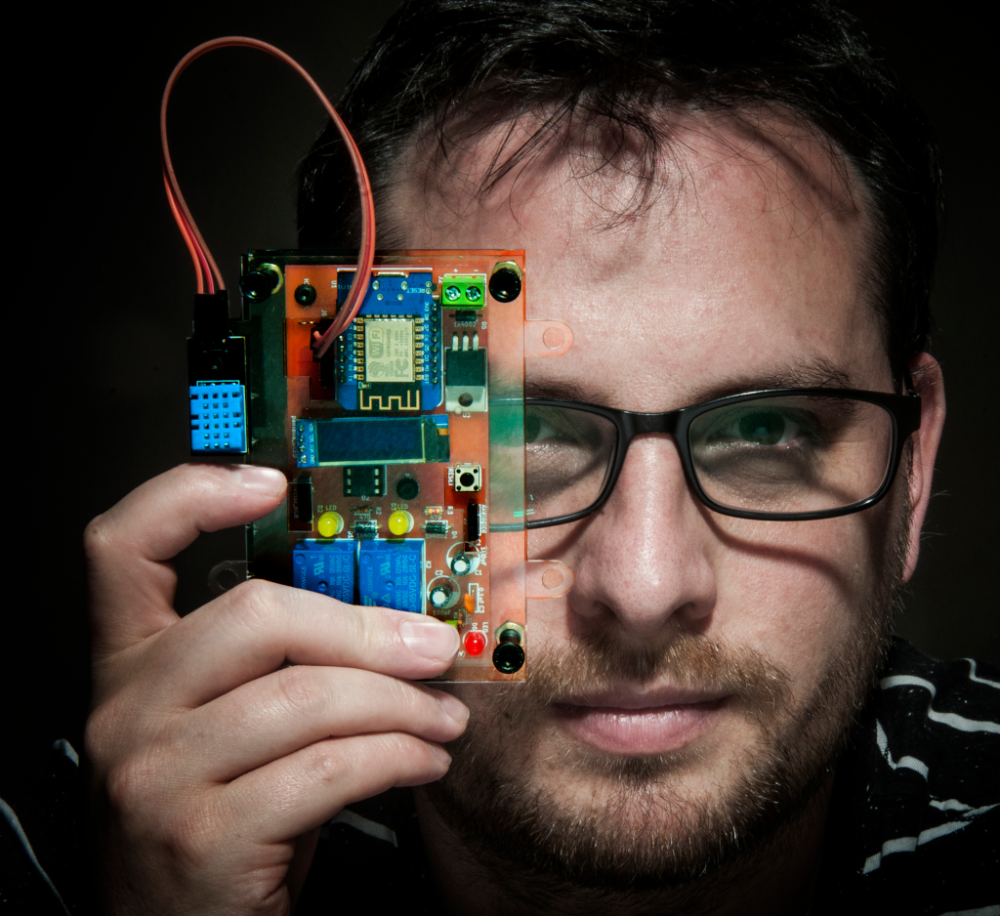

---
# Feel free to add content and custom Front Matter to this file.
# To modify the layout, see https://jekyllrb.com/docs/themes/#overriding-theme-defaults

layout: home
---

# Dr. Valentín Basel

Analista en sistemas informáticos, Licenciado en tecnología educativa y Doctor en educación en ciencia básica y tecnología (FAMAF-UNC).

Profesional Adjunto en el departamento de sistemas del CIECS-CONICET donde desarrolla software para análisis de datos cualitativos y coordina el Programa de Investigación y desarrollo de herramientas digitales libres para educación y ciencias sociales (Pidhlecs).

Profesor asistente en la sección computación en la facultad de astronomía matemática y computación en la Universidad Nacional de Córdoba, Argentina (FAMAF-UNC) en las materias de **Organización del computador** y **Arquitectura de procesadores**.

Profesor Adjunto en la tecnicatura de ciencia de datos para cientificos sociales de la Universidad Nacional de Villa Maria (UNVM) en la materia de **Programación 1**.

Especializado en el desarrollo de herramientas didácticas de software libre y hardware de especificaciones libres para la enseñanza de programación con robótica educativa. Desarrollador principal del proyecto ICARO, software y hardware libre para la enseñanza de programación en escuelas secundarias.

Coordino el programa **PIDHLECS** — Programa de Investigación y Desarrollo de Herramientas Digitales Libres para Educación y Ciencias Sociales, orientado al desarrollo de herramientas digitales libres para investigación y educación, perteneciente al **CIECS-UNC-CONICET**

Participo en comunidades de desarrollo de software libre en Argentina desde el año 2003, siendo embajador de la comunidad FEDORA GNU/Linux en Argentina.

